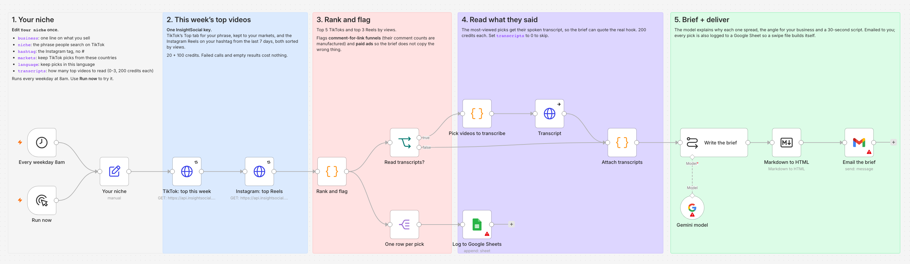

# Viral Content Radar (n8n + InsightSocial)

Every weekday at 8am this workflow finds the most-viewed TikToks and Instagram Reels in your
niche from the past week. It reads what the top video actually says, then emails you a brief:
why each video spread, the angle for **your** business, and a 30-second script you can shoot
today. Every pick is also logged to a Google Sheet, so you build up a swipe file over time.

One run costs **320 credits** with one transcript, or **120** without. That is measured, not
estimated: the full breakdown is under [Cost](#cost).

## What you get

A real brief from one run is in [`samples/brief-budget-travel.md`](samples/brief-budget-travel.md),
unedited. The picks it was written from are in
[`samples/picks-budget-travel.json`](samples/picks-budget-travel.json). An excerpt:

> **1. @brooke_volpe - How to travel the world without going broke**
>
> **Why it spread:** This video spread because it offered a highly practical, step-by-step
> tutorial for a common pain point: expensive flights. The hook, "here's a full tutorial on how to
> travel the world without going broke especially if you've been saving thousands and it's just
> going to a plane ticket," directly addressed the desire for affordable global travel, and its
> high save count confirms its utility as a valuable resource.

That hook line came from the video's spoken transcript, not its caption.

## How it works

1. **Your niche.** You set it once in the `Your niche` node: what you sell, the phrase people
   search on TikTok, the Instagram hashtag, your markets and your language.
2. **This week's top videos.** It makes two calls with one InsightSocial key. One gets TikTok's
   Top tab for your phrase, kept to your markets and sorted by views. The other gets the Reels on
   your hashtag from the last 7 days, also sorted by views.
3. **Rank and flag.** It keeps the top 5 TikToks and top 3 Reels, drops the ones the API marks as
   another language, and flags comment-for-link funnels and paid ads (more on both below).
4. **Read what they said.** For the most-viewed picks it pulls the spoken transcript, so the brief
   can quote the real hook. The number of transcripts is set by `transcripts` (0 to 3).
5. **Brief + deliver.** A model writes the brief. It gets emailed to you as HTML, and each pick
   is added as a row in Google Sheets.

## What changed the picks (measured)

The obvious version just sorts everything by views. We built that first, and it picked the
wrong videos for three different reasons:

**1. TikTok's Top tab is global.** We pulled the Top tab for four niches. In three of them (`ai
automation`, `home workout`, `skincare routine`), only 13 to 15 of the roughly 30 videos came
from the US, UK, Canada, Australia, Ireland or New Zealand. The #1 video by views came from
Portugal, Turkey and Nigeria. If you sell in the US, those are other people's trends. The
`markets` setting keeps only videos registered to the countries you list. The filter runs on
our side, so it doesn't change the price.

**2. Some comment counts are manufactured.** Captions like *Comment "PREP" for the recipes* set
off an auto-DM that sends the link, so the comments measure a funnel, not interest. Of 70
Instagram Reels across five searches, 19 were comment-for-link funnels. That includes 9 of the
30 Reels on #mealprep. One had 5,788 comments and 4,410 likes. The radar flags these funnels
and tells the model not to read their comment counts as demand.

**3. Instagram keyword search has no view counts.** All 40 keyword-search Reels from four niches
came back without views. The hashtag Reels tab had views on all 30 Reels we pulled, so the radar
searches the hashtag. Hashtags have no country filter, so the radar can filter by language
instead: it drops a pick whose `post.language` is not your `language`. In the budget-travel run, 3
of the 8 Reels on #budgettravel were not in English. Today neither search reports a language
(`post.language` is `null` on every row we pulled in October 2026), and a pick with no language is
kept, so expect the occasional Reel in another language until it does.

## Cost

Credits are per call and per endpoint. Failed calls and empty results cost nothing.

| Call | Credits |
|---|---|
| TikTok Top tab for your phrase (`/v1/tiktok/search/top`) | 20 |
| Instagram hashtag Reels (`/v1/instagram/search/hashtag`) | 100 |
| Each transcript (`/v1/tiktok/post/transcript` or `/v1/instagram/media/transcript`) | 200 |
| **One run, 1 transcript (the default)** | **320** |
| One run, no transcripts | 120 |

A weekday schedule is about 22 runs a month: about 7,040 credits with one transcript, or 2,640
without. Pro includes 10,000 credits a month. The free plan's 500 covers four runs without
transcripts. If someone made the same search within the last hour, the shared cache can answer
it for less (we saw 5 credits instead of 20). Plans are at
[insightsocial.app/pricing](https://www.insightsocial.app/pricing).

The model step runs on Gemini 2.5 Flash, and its cost depends on your Google account. In our
runs, the model read 600 to 1,000 words of input plus its instructions, and wrote 1,400 to 1,800
words.

## Setup

1. **Import** [`viral-content-radar.workflow.json`](viral-content-radar.workflow.json) into n8n
   (Workflows > Import from File).
2. **InsightSocial key.** Get a key at
   [insightsocial.app/portal/api/keys](https://www.insightsocial.app/portal/api/keys). The free
   plan works. In n8n, create a **Header Auth** credential named `InsightSocial API`: set Name to
   `x-api-key` and Value to your key. Select it on the three HTTP nodes: `TikTok: top this week`,
   `Instagram: top Reels` and `Transcript`.
3. **Model.** Add a **Google Gemini** credential on `Gemini model`, using a key from
   [Google AI Studio](https://aistudio.google.com/apikey). Any n8n chat model node works in its
   place.
4. **Gmail + Google Sheets.** Connect both. In `Log to Google Sheets`, pick a spreadsheet whose
   first row is `date, rank, platform, author, views, likes, comments, saves, comment_funnel, ad,
   url, caption`.
5. **Your niche.** Edit the `Your niche` node and click **Execute workflow**. Once the brief looks
   right, activate the workflow.

| Setting | Example | What it does |
|---|---|---|
| `business` | A meal-prep delivery service for busy families | Gives the brief an angle for you |
| `niche` | meal prep | The phrase searched on TikTok |
| `hashtag` | mealprep | The Instagram hashtag, without # |
| `markets` | US,GB,CA,AU | Keeps TikToks from these countries |
| `language` | en | Keeps picks in this language when the API reports one; blank keeps all |
| `top_tiktok` / `top_reels` | 5 / 3 | How many picks per platform |
| `transcripts` | 1 | How many top picks to transcribe, 0 to 3 |
| `email_to` | you@example.com | Who gets the brief |

## Swap in anything

The HTTP nodes call plain REST endpoints that all return the same JSON envelope. To try another
source, change the path in a node, for example:

- `/v1/youtube/shorts/trending`
- `/v1/tiktok/search`
- `/v1/instagram/search/reels`

The full list is at
[`api.insightsocial.app/v1/endpoints`](https://api.insightsocial.app/v1/endpoints), which is free
and needs no key. It shows every path, parameter and price. Docs:
[insightsocial.app/docs](https://www.insightsocial.app/docs).

## Honest caveats

- A run takes about a minute. Most of that is the model.
- Videos with little speech (music over B-roll) come back with transcripts that read as noise.
  The model is told to ignore them, but the transcript still costs 200 credits. Lower
  `transcripts` if your niche is mostly visual.
- Instagram reports no save or share counts here, so Reels rank by views alone. TikTok picks
  carry saves too.
- The flags come from simple caption patterns: `Comment "WORD"`, `#ad`, `paid partnership`. A
  funnel phrased another way won't be flagged.
- The model writes ideas, not facts. Every number in the brief comes from the data, and the
  prompt forbids inventing others. Still read the brief before you shoot.

## License

MIT
